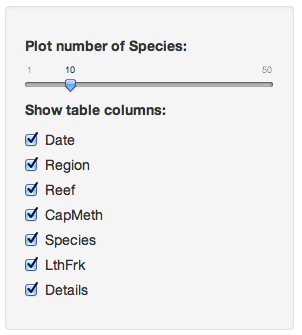
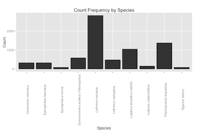
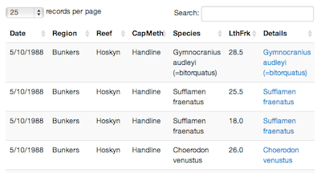

Great Barrier Reef App
======================
- One of the natural wonders of the world
- App displays results of a reef fish-counting survey
- Data displayed interactively in graph and table
- Thanks to Ian Walkden Brown for a really interesting dataset

Introduction
============
The Reef
--------
- World's largest coral reef system
- Much protected by [Great Barrier Reef Marine Park](http://www.gbrmpa.gov.au/)


```r
area = 1400*95 # miles long x miles wide
area # square miles
```

```
[1] 133000
```

***
Dataset
-------
- [Great Barrier Reef Fish Biological Data](http://era.deedi.qld.gov.au/1776/)
- Over 9671 observations of 15 variables
- In csv file, so not easy to explore
        
App Layout
==========
left:50%
Left sidebar
------------


- **Slider:** fish species in Plot
- **Checkboxes:** table columns.
***
Main panel
----------
Detailed (tabbed) display

- **Plot Tab:** Interactive plot of main species measured
- **Table Tab:** Interactive table of raw data
- **Dataset Tab:** Dataset details and acknowledgements

Plot Tab
========
Bar chart of the frequency with which fish were found

- **X-Axis:** Species names
- **Y-Axis:** Count of fish in dataset
- **Slider:** Adjusts the number of species shown

***



Table Tab
=========
Displays six columns of data from the dataset in an interactive table

- **Column names:** See Dataset tab for details
- **Checkboxes:** Unchecking the checkbox removes the corresponding column
- **Details:** Hyperlinks to massive database of fish

***


